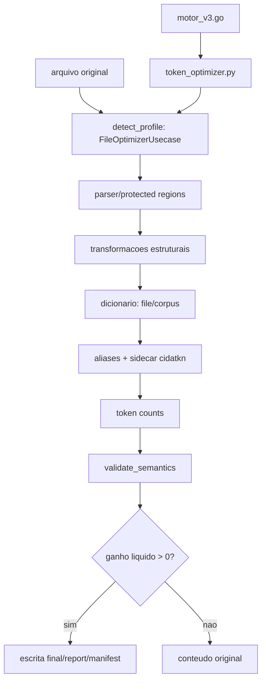

# Relatorio tecnico de compressao Markdown - CIDA Motor

## 1. Sumario executivo

STATUS: MARKDOWN_COMPRESSION_IMPROVEMENT_PLAN_READY.

O corpus auditado tem 23 arquivos (10 reais, 13 sinteticos), 2825413 bytes e 487457 tokens originais. No pipeline atual com dicionario por arquivo, a economia liquida agregada foi 50586 tokens (10.38%), mas esse numero nao deve ser apresentado como ganho geral dos arquivos reais: os arquivos reais economizaram 8 tokens de 4504 (0.1776%), enquanto os sinteticos economizaram 50578 tokens de 482953 (10.4727%). O ganho ficou concentrado em arquivos sinteticos altamente repetitivos, especialmente `synthetic/large_repetitive.md`; nos arquivos reais, os melhores ganhos foram micro reducoes de 1 a 2 tokens. Media por arquivo: 3.99%; mediana: 0.00%. Arquivos com ganho: 9; inalterados: 14; inflados liquidos: 0.

A recomendacao principal e corrigir a decisao por ganho real de tokens, cachear contagens/parsing e explicitar o contrato de reversibilidade. O risco geral e MEDIUM/HIGH quando byte-perfect round trip for obrigatorio, porque transformacoes estruturais aceitas hoje nao carregam patches de reversao. A simulacao de frases/n-grams deve permanecer experimental: ha sobreposicao de n-grams, dupla contagem potencial, ausencia de aplicacao real, ausencia de sidecar real e ausencia de round trip comprovado.

## 2. Escopo e metodologia

| Campo | Valor |
| --- | --- |
| REPOSITORY_ROOT | <repository-root> |
| BRANCH | refactor/python-clean-architecture |
| HEAD_SHA | 6aaee045a1cc4f95fb6e767e8e20b6db75e86fb3 |
| WORKING_TREE_STATUS | M .gitignore A  cida/application/__init__.py A  cida/application/generate_manifest.py A  cida/application/generate_report.py A  cida/application/optimize_corpus.py A  cida/application/optimize_file.py A  cida/application/ports.py A  cida/application/validate_sidecar.py  M markdown/block_parser.py  M markdown/phrase_dictionary.py  M markdown/protected_regions.py  M markdown/report.py  M markdown/semantic_validator.py  M markdown/sidecar.py  M tests/test_integration.py  M token_counter.py  M token_optimizer.py  M translate.py ?? cida/__init__.py ?? cida/infrastructure/ ?? cida/interfaces/ ?? cida/markdown/ ?? docs/ ?? tests/architecture/ ?? tests/test_contracts.py ?? tests/test_domain.py ?? tests/test_property.py |
| PYTHON_VERSION | 3.11.9 |
| GO_VERSION | go version go1.26.5 windows/amd64 |
| TOKENIZER_VERSION | tiktoken cl100k_base via OfflineTokenizer |
| TOKENIZER_RESOURCE_SHA | 223921b76ee99bde995b7ff738513eef100fb51d18c93597a113bcffe865b2a7 |
| OPERATING_SYSTEM | Windows 10 10.0.26300 AMD64 |

Formulas usadas: economia bruta = tokens_originais - tokens_transformados; overhead = tokens_sidecar + tokens_auxiliares; tokens finais = tokens_transformados + overhead; economia liquida = tokens_originais - tokens finais; compressao de bytes = 1 - bytes_finais_totais / bytes_originais. Bytes, caracteres e tokens foram mantidos separados.

## 3. Arquitetura atual

| Etapa | Modulo | Funcao/classe | Falha possivel | Impacto em economia |
| --- | --- | --- | --- | --- |
| Perfil | cida/application/optimize_file.py | detect_profile | classificacao bmad ampla | escolhe protecoes/transforms |
| Parsing | cida/markdown/parser.py | parse_markdown | frontmatter/fence/comentario nao fechado | pode rejeitar transforms |
| Protecao | cida/markdown/protected_regions.py | ProtectedRegionsManager | regex excessiva ou placeholder colisivel | reduz superficie compressivel |
| Transforms | cida/markdown/transforms.py | remove/trim/normalize/table/list | perda byte-perfect | economia estrutural sem sidecar |
| Dicionario | cida/markdown/dictionary.py | build_file_dictionary/build_corpus_dictionary | alias ruim, overhead sidecar | principal fonte de ganho em textos repetitivos |
| Sidecar | cida/domain/sidecar.py | create_sidecar_data/validate_sidecar | schema JSON e hash | overhead e reversao de aliases |
| Semantica | cida/markdown/semantic_equivalence.py | validate_semantics | FP/FN em Markdown adversarial | aceita/rejeita ganho |
| Relatorio | cida/application/generate_report.py | ReportGeneratorUsecase | campos deterministas | evidencia de ganho liquido |
| Go -> Python | motor_v3.go | subprocess token_counter/token_optimizer | subprocess por contagem | custo de tempo |

## 4. Resultados quantitativos

| Metrica | Valor |
| --- | --- |
| tokens originais | 487457 |
| tokens transformados | 436645 |
| tokens sidecar | 206 |
| tokens auxiliares | 20 |
| economia bruta | 50812 |
| overhead | 226 |
| economia liquida | 50586 |
| economia liquida percentual | 10.38% |

### Separacao real vs sintetico

| Grupo | Arquivos | Tokens originais | Tokens finais | Economia liquida | Economia liquida % |
| --- | ---: | ---: | ---: | ---: | ---: |
| Arquivos reais | 10 | 4504 | 4496 | 8 | 0.1776% |
| Arquivos sinteticos | 13 | 482953 | 432375 | 50578 | 10.4727% |

O resultado agregado de 10.38% e dominado pelos arquivos sinteticos. Ele nao representa ganho produtivo comprovado no corpus real medido.

### Por estrategia de dicionario

| Estrategia | Tokens finais | Economia liquida | Arquivos com ganho | Inflados |
| --- | --- | --- | --- | --- |
| A_sem_dicionario | 487445 | 12 (0.00%) | 9 | 0 |
| B_dicionario_por_arquivo | 436871 | 50586 (10.38%) | 9 | 0 |
| C_dicionario_por_diretorio | 436619 | 50838 (10.43%) | 3 | 0 |
| D_dicionario_por_corpus | 436691 | 50766 (10.41%) | 11 | 0 |
| E_hibrida_simulada | 436542 | 50915 (10.45%) | 11 | 0 |
| F_frases_simulada | 206937 | 280520 (57.55%) | 10 | 0 |

`F_frases_simulada` e apenas uma simulacao. Ela nao aplica aliases de frase no pipeline produtivo, nao gera sidecar real e nao prova round trip byte-perfect.

### Por perfil/forma

| Perfil | Arquivos | Tokens originais | Tokens finais | Economia |
| --- | --- | --- | --- | --- |
| BMAD | 6 | 2780 | 2777 | 3 |
| small files | 8 | 3254 | 2562 | 692 |
| code-heavy | 7 | 5417 | 5413 | 4 |
| Markdown | 2 | 476006 | 426119 | 49887 |

## 5. Sidecars

Sidecars foram criados em 2 arquivos. O overhead total medido foi 226 tokens. O ponto de equilibrio observado exige que cada candidato pague seu custo no JSON e a instrucao auxiliar; abaixo disso o pipeline reverte para o original. Arquivos micro e pequenos tenderam a nao pagar o sidecar.

## 6. Round trip e semantica

| Metrica | Valor |
| --- | --- |
| roundtrip cases | 23 |
| passed | 14 |
| failed | 9 |
| byte-perfect rate | 60.87% |
| TRUE_POSITIVE | 2 |
| TRUE_NEGATIVE | 6 |
| FALSE_POSITIVE | 0 |
| FALSE_NEGATIVE | 1 |

Quando o arquivo final inclui transformacoes estruturais sem sidecar de patches, a reversao por aliases nao reconstrói os bytes originais. Isso deve ser tratado como limitacao contratual, nao como bug isolado de teste.

## 7. Performance

| Metrica | Valor |
| --- | --- |
| tempo total | 185.869s |
| tempo por MB | 68.980s/MB |
| tempo tokenizer | 31.913s |
| chamadas tokenizer | 17206 |
| tempo parsing | 1.267s |
| tempo validacao | 21.567s |
| pico memoria | 56949461 |

## 8. Determinismo

| Run | Hash |
| --- | --- |
| run 1 | f6d3495cefeec02fa9680795c7b810a4a4fc028e06c46748506e4e11c23779bf |
| run 2 | f6d3495cefeec02fa9680795c7b810a4a4fc028e06c46748506e4e11c23779bf |
| run 3 | f6d3495cefeec02fa9680795c7b810a4a4fc028e06c46748506e4e11c23779bf |
| Windows | f6d3495cefeec02fa9680795c7b810a4a4fc028e06c46748506e4e11c23779bf |
| Ubuntu | NOT_EXECUTED |

Campos de duracao, memoria, plataforma, caminhos absolutos e diretorios temporarios foram excluidos do hash analitico. Ubuntu nao foi executado nesta maquina.

## 9. Seguranca

| ID | Risco | Severidade | Mitigacao |
| --- | --- | --- | --- |
| R-01 | Transformacoes estruturais nao sao reversiveis byte a byte sem sidecar de patches | HIGH | Adicionar contrato explicito ou sidecar de reversao |
| R-02 | Parser falha em fences/frontmatter invalidos e pode rejeitar ganho seguro | MEDIUM | Tratar parse error como zona protegida total |
| R-03 | Sidecar JSON com entries objeto nao detecta chaves duplicadas no parse JSON padrao | MEDIUM | Decoder com object_pairs_hook para duplicatas |
| R-04 | Alias curto pode ter tokenizacao ruim e colisao contextual | MEDIUM | Gerador token-aware + validacao contra regioes protegidas |
| R-05 | Regex em entradas grandes pode custar caro | LOW | Benchmarks adversariais e limites de tamanho |
| R-06 | Ubuntu nao foi executado nesta rodada | INFORMATIONAL | CI matrix Windows/Ubuntu com hash normalizado |

## 10. Oportunidades de melhoria

| ID | Melhoria | Problema resolvido | Ganho esperado | Risco | Complexidade | Prioridade |
| --- | --- | --- | --- | --- | --- | --- |
| MC-01 | Aliases token-aware | Substituir ordenacao freq*chars por ganho liquido por token | ate 50586 tokens no corpus misto; apenas 8 tokens comprovados nos arquivos reais medidos | LOW | M | P1 |
| MC-02 | Limiar adaptativo | Ignorar dicionario em micro/pequenos sem break-even | evita inflacao; ganho indireto medido por zero-overhead | LOW | S | P1 |
| MC-03 | Sidecar compacto | JSON minificado ou arrays versionados | reduz overhead de sidecar observado | MEDIUM | M | P2 |
| MC-04 | Dicionario hibrido | Termos globais + locais com sidecars separados | 50915 (10.45%) | MEDIUM | L | P2 |
| MC-05 | N-grams/frases | Simular e aceitar apenas frases com ganho liquido, sem sobreposicao e com sidecar/round trip reais | 280520 tokens simulados; ganho produtivo nao comprovado | MEDIUM | L | P3 |
| MC-06 | Parsing unico | Compartilhar AST/regioes protegidas entre transformacoes | 1.267s parsing medido | LOW | M | P1 |
| MC-07 | Tokenizacao em lote/cache SHA | Evitar contagens repetidas | 17206 chamadas; 31.913s | LOW | M | P1 |
| MC-08 | Compressao dentro de codigo | Processar fences por perfil separado | nao recomendado sem contrato novo | HIGH | L | P4 |

## 11. Roadmap

Fase 1 - medicoes e quick wins: corrigir metricas por tokens reais, aliases token-aware, cache simples por SHA, limiar adaptativo e testes de break-even. Aceite: economia liquida nunca negativa e roundtrip classificado.

Fase 2 - melhorias estruturais: dicionario hibrido, sidecar compacto, tokenizacao em lote, parsing unico. Aceite: melhoria mensuravel contra corpus e manifests deterministas.

Fase 3 - experimentos: frases/n-grams, perfis adaptativos, paralelismo deterministico e modelos de decisao por corpus. Aceite: simulacao primeiro, feature flag, rollback por estrategia A.

## 12. Limitacoes

O corpus combina arquivos reais e sinteticos. A validacao Ubuntu nao foi executada localmente. O Harness Engineer Local Runtime solicitado nao foi encontrado no repositorio. As estrategias hibrida e frases sao simulacoes de ganho, nao implementacao produtiva.

## 13. Riscos residuais

Persistem riscos de falso positivo semantico em Markdown adversarial, overhead de sidecar em arquivos pequenos, divergencia cross-platform nao validada em Ubuntu e ausencia de contrato unico entre equivalencia semantica e byte-perfect.

## 14. Conclusao

| Campo | Valor |
| --- | --- |
| CURRENT_COMPRESSION_ASSESSMENT | Economia liquida agregada de 50586 tokens (10.38%) no corpus misto; arquivos reais medidos tiveram 8 tokens (0.1776%) e o ganho ficou concentrado em repeticao sintetica longa. |
| RECOMMENDED_NEXT_ACTION | Fase 1: aliases token-aware, limiar adaptativo, cache/tokenizacao e testes de break-even/roundtrip. |
| EXPECTED_GAIN_RANGE | Baixo a moderado no corpus misto; maior em arquivos grandes repetitivos e menor/zero em micro arquivos. |
| IMPLEMENTATION_RISK | MEDIUM se exigir semantica; HIGH se exigir byte-perfect para transforms estruturais sem sidecar de patches. |
