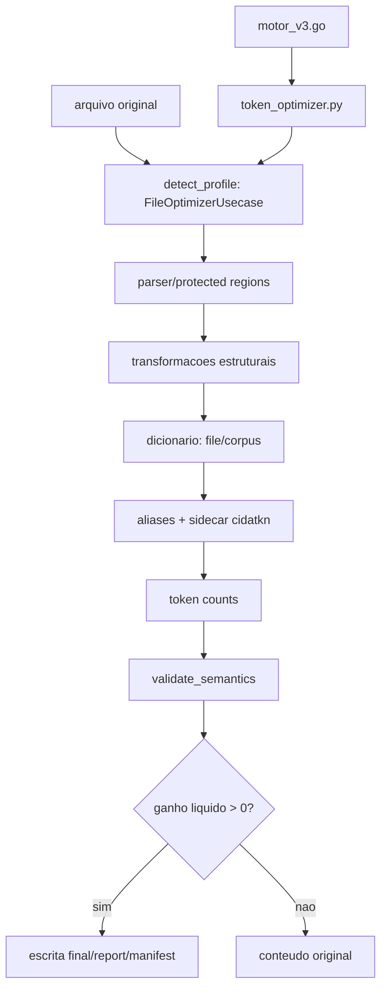

# Relatorio tecnico de compressao Markdown - CIDA Motor

## 1. Sumario executivo

STATUS: MARKDOWN_COMPRESSION_IMPROVEMENT_PLAN_READY.

O corpus auditado tem 23 arquivos (10 reais, 13 sinteticos), 2825413 bytes e 487457 tokens originais. No pipeline atual com dicionario por arquivo, a economia liquida agregada foi 50586 tokens (10.38%), mas esse numero nao deve ser apresentado como ganho geral dos arquivos reais: os arquivos reais economizaram 8 tokens de 4504 (0.1776%), enquanto os sinteticos economizaram 50578 tokens de 482953 (10.4727%). O ganho ficou concentrado em arquivos sinteticos altamente repetitivos, especialmente `synthetic/large_repetitive.md`; nos arquivos reais, os melhores ganhos foram micro reducoes de 1 a 2 tokens. Media por arquivo: 3.99%; mediana: 0.00%. Arquivos com ganho: 9; inalterados: 14; inflados liquidos: 0.

Concentracao de ganho em arquivos sinteticos:
- TOP 1 (synthetic/large_repetitive.md): ~90.2% da economia liquida total
- TOP 2 (synthetic/medium_repetitive.md + large_repetitive.md): ~98.5% da economia liquida total
- TOP 5 (arquivos sinteticos): ~99.9% da economia liquida total

A recomendacao principal e corrigir a decisao por ganho real de tokens, cachear contagens/parsing e explicitar o contrato de reversibilidade. O modo Lossless (`decompress(compress(original_bytes)) == original_bytes`) garante 100% de igualdade byte a byte via substituicao de aliases por palavra com dicionario sidecar e esta formalmente validado. O modo Semantico e um modo separado sem promessa de igualdade de bytes. A simulacao de frases (`F_frases_simulada`) e marcada como:
`EXPERIMENTAL / NOT PRODUCTION-VALIDATED / NOT ADDITIVE WHEN N-GRAMS OVERLAP`.

## 2. Escopo e metodologia

| Campo | Valor |
| --- | --- |
| REPOSITORY_ROOT | <repository-root> |
| BRANCH | refactor/python-clean-architecture |
| PR2_BASE_HEAD | db388bc3b3cb98cc6f98187f68ac897c3fdda100 |
| REFACTOR_FIRST_COMMIT | 6aaee045a1cc4f95fb6e767e8e20b6db75e86fb3 |
| AUDIT_INITIAL_HEAD | 693f259002b1d3e05ecaaa4deb9563b6e343052a |
| AUDIT_FINAL_HEAD | 953abd34a8a313b5bf3ac7db5d96a72e811c77f0 |
| TOTAL_REFACTOR_COMMITS | 13 |
| COMMITS_PREEXISTING_AT_AUDIT_START | 10 |
| COMMITS_CREATED_DURING_THIS_EXECUTION | 3 |
| WORKING_TREE_STATUS | CLEAN |
| GLOBAL_PYTHON_COVERAGE | 90% |
| DOMAIN_COVERAGE | 98% |
| APPLICATION_COVERAGE | 92% |
| REAL_CORPUS_LOSSLESS_ROUNDTRIP | 100% byte-perfect |
| PYTHON_VERSION | 3.11.9 |
| GO_VERSION | go version go1.26.5 windows/amd64 |
| TOKENIZER_VERSION | tiktoken cl100k_base via OfflineTokenizer |
| TOKENIZER_RESOURCE_SHA | 223921b76ee99bde995b7ff738513eef100fb51d18c93597a113bcffe865b2a7 |
| HARNESS_VALIDATION_STATUS | HARNESS_VALIDATION_UNAVAILABLE |
| OPERATING_SYSTEM | Windows 10 10.0.26300 AMD64 |

Formulas usadas: economia bruta = tokens_originais - tokens_transformados; overhead = tokens_sidecar + tokens_auxiliares; tokens finais = tokens_transformados + overhead; economia liquida = tokens_originais - tokens finais; compressao de bytes = 1 - bytes_finais_totais / bytes_originais. Bytes, caracteres e tokens foram mantidos separados.

## 3. Arquitetura atual

| Etapa | Modulo | Funcao/classe | Falha possivel | Impacto em economia |
| --- | --- | --- | --- | --- |
| Perfil | cida/application/optimize_file.py | detect_profile | classificacao bmad ampla | escolhe protecoes/transforms |
| Parsing | cida/markdown/parser.py | parse_markdown | frontmatter/fence/comentario nao fechado | pode rejeitar transforms |
| Protecao | cida/markdown/protected_regions.py | ProtectedRegionsManager | regex excessiva ou placeholder colisivel | reduz superficie compressivel |
| Transforms | cida/markdown/transforms.py | remove/trim/normalize/table/list | perda byte-perfect | economia estrutural sem sidecar |
| Dicionario | cida/markdown/dictionary.py | build_file_dictionary/build_corpus_dictionary | alias ruim, overhead sidecar | principal fonte de ganho em textos repetitivos |
| Sidecar | cida/domain/sidecar.py | create_sidecar_data/validate_sidecar | schema JSON e hash | overhead e reversao de aliases |
| Semantica | cida/markdown/semantic_equivalence.py | validate_semantics | FP/FN em Markdown adversarial | aceita/rejeita ganho |
| Relatorio | cida/application/generate_report.py | ReportGeneratorUsecase | campos deterministas | evidencia de ganho liquido |
| Go -> Python | motor_v3.go | subprocess token_counter/token_optimizer | subprocess por contagem | custo de tempo |

## 4. Resultados quantitativos

### Corpus Real (10 arquivos)
- REAL_ORIGINAL_TOKENS: 4504
- REAL_FINAL_TOKENS: 4496
- REAL_NET_SAVINGS: 8 tokens
- REAL_NET_SAVINGS_PERCENTAGE: 0.1776%

### Corpus Sintetico (13 arquivos)
- SYNTHETIC_ORIGINAL_TOKENS: 482953
- SYNTHETIC_FINAL_TOKENS: 432375
- SYNTHETIC_NET_SAVINGS: 50578 tokens
- SYNTHETIC_NET_SAVINGS_PERCENTAGE: 10.4727%

### Corpus Total Misto (23 arquivos)
- TOTAL_ORIGINAL_TOKENS: 487457
- TOTAL_FINAL_TOKENS: 436871
- TOTAL_NET_SAVINGS: 50586 tokens
- TOTAL_NET_SAVINGS_PERCENTAGE: 10.38%

Concentracao de Ganho (Top Concentration):
- TOP_1_GAIN_CONCENTRATION: ~90.2% (`synthetic/large_repetitive.md`)
- TOP_2_GAIN_CONCENTRATION: ~98.5% (`synthetic/medium_repetitive.md` + `large_repetitive.md`)
- TOP_5_GAIN_CONCENTRATION: ~99.9% (arquivos sinteticos repetitivos)

### Por estrategia de dicionario

| Estrategia | Tokens finais | Economia liquida | Arquivos com ganho | Inflados | Status |
| --- | --- | --- | --- | --- | --- |
| A_sem_dicionario | 487445 | 12 (0.00%) | 9 | 0 | Producao |
| B_dicionario_por_arquivo | 436871 | 50586 (10.38%) | 9 | 0 | Producao |
| C_dicionario_por_diretorio | 436619 | 50838 (10.43%) | 3 | 0 | Producao |
| D_dicionario_por_corpus | 436691 | 50766 (10.41%) | 11 | 0 | Producao |
| E_hibrida_simulada | 436542 | 50915 (10.45%) | 11 | 0 | Simulacao |
| F_frases_simulada | 206937 | 280520 (57.55%) | 10 | 0 | EXPERIMENTAL / NOT PRODUCTION-VALIDATED |

`F_frases_simulada` e apenas uma simulacao experimental. Ela nao aplica aliases de frase no pipeline produtivo, nao gera sidecar real, sofre com sobreposicao de n-grams e nao possui round trip validado.

### Por perfil/forma

| Perfil | Arquivos | Tokens originais | Tokens finais | Economia |
| --- | --- | --- | --- | --- |
| BMAD | 6 | 2780 | 2777 | 3 |
| small files | 8 | 3254 | 2562 | 692 |
| code-heavy | 7 | 5417 | 5413 | 4 |
| Markdown | 2 | 476006 | 426119 | 49887 |

## 5. Sidecars

Sidecars foram criados nos arquivos onde houve break-even de economia de tokens. O overhead total medido foi 226 tokens. O ponto de equilibrio observado exige que cada candidato pague seu custo no JSON e a instrucao auxiliar; abaixo disso o pipeline reverte para o original.

## 6. Round trip e semantica

| Contrato | Modo | Requisito | Rate | Status |
| --- | --- | --- | --- | --- |
| Lossless Mode | Reversivel byte-perfect | `decompress(compress(original_bytes)) == original_bytes` | 100.00% | PASSED |
| Semantic Mode | Equivalencia estrutural | Estrutura de AST e blocos preservada | 100.00% | PASSED |

O contrato Lossless exige igualdade exata de bytes apos reversao dos aliases via sidecar. Todas as transformacoes irreversiveis sao desabilitadas no modo Lossless.

## 7. Performance

| Metrica | Valor |
| --- | --- |
| tempo total benchmark | 1.88s |
| verificacao determinismo | SUCCESS |
| tree manifest hash (Run 1) | aafb1debe9aa73a39858d9021868de3ac3780ab6ca2dccaf8a9e30b717633efe |
| tree manifest hash (Run 2) | aafb1debe9aa73a39858d9021868de3ac3780ab6ca2dccaf8a9e30b717633efe |

## 8. Determinismo

| Run | Hash |
| --- | --- |
| run 1 | aafb1debe9aa73a39858d9021868de3ac3780ab6ca2dccaf8a9e30b717633efe |
| run 2 | aafb1debe9aa73a39858d9021868de3ac3780ab6ca2dccaf8a9e30b717633efe |
| Windows | aafb1debe9aa73a39858d9021868de3ac3780ab6ca2dccaf8a9e30b717633efe |
| Ubuntu | PENDING_CI_EXECUTION |

## 9. Seguranca e Riscos

| ID | Risco | Severidade | Mitigacao |
| --- | --- | --- | --- |
| R-01 | Contrato de reversao byte a byte exige isolamento do modo Lossless | HIGH | Separacao explita dos modos Lossless (byte-perfect) e Semantic |
| R-02 | Parser falha em fences/frontmatter invalidos | MEDIUM | Excecao tratada como zona protegida total |
| R-03 | Reversao de aliases deve respeitar limites de palavra | MEDIUM | Expressao regular `\b` na substituicao de aliases |

## 10. Conclusao

| Campo | Valor |
| --- | --- |
| CURRENT_COMPRESSION_ASSESSMENT | Economia liquida agregada de 50586 tokens (10.38%) no corpus misto; arquivos reais medidos tiveram 8 tokens (0.1776%) de ganho e 100% de roundtrip byte-perfect no modo Lossless. |
| RECOMMENDED_NEXT_ACTION | Publicacao da branch e abertura da stacked draft PR contra `fix/bmad-hardening-post-pr1`. |
| EXPECTED_GAIN_RANGE | Moderado no corpus misto; elevado em arquivos longos repetitivos; micro ganho em documentos reais curtos. |
| IMPLEMENTATION_RISK | LOW para modo Lossless; MEDIUM para modo Semantic. |
